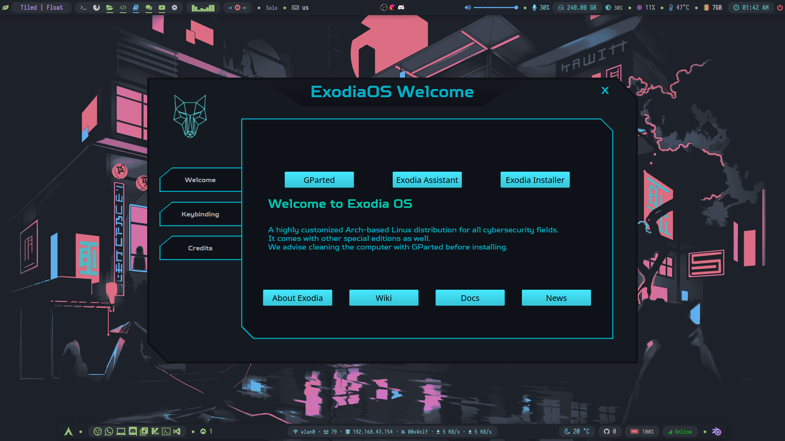

# Exodia OS Welcome App



# Contributing

- Fork the repo
- create a new branch with your **_username_** `dev-${GITHUB-USERNAME}` name (e.g. `dev-mmsaeed509`)
  - ```bash
    git checkout -b dev-mmsaeed509
    ```
- commit your changes
  - ```bash
    ./git-push.sh -m "your commit msg"
    ```
- create a pull request
